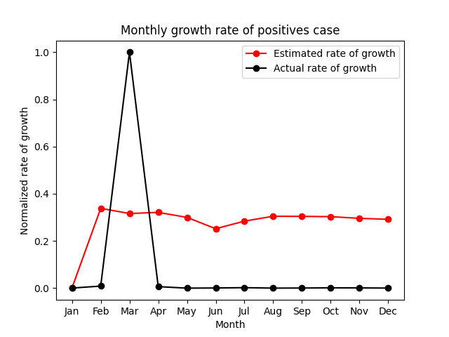
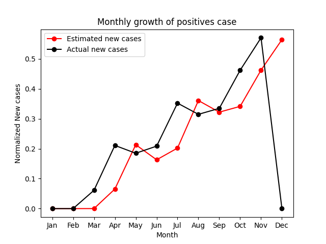

# Simulating an estimated on prevented COVID-19 cases because of established testing centers

## Description

As the COVID-19 cases began to increase exponentially, many countries established testing centers. The established centers are convenient and affordable (even free in some places) in order to encourage people to get themselves tested. Presuming that a positively tested individual has minimized interaction by self-quarantining themselves, I would like to simulate an estimate on the number of individuals the virus could've potentially spread had there been no testing centers, making them unaware of their infection.

## Assumptions

Assuming against a scenario where a person immediately quarantines themselves after being diagnosed COVID 19 positive.
If the symptom onset date (date when the symptoms are first detected) is empty, it is assumed that the person is asymptotic.
Assuming that simulated new cases are carried into the next month

## Randomized variables:

1. The number of individuals a person comes into contact with, after being infected by the virus but the person being unaware of their infection.

2. The total number of days an infected person is likely to act as an active carrier of the virus

## Hypothesis:

The availability and periodic use of COVID-19 virus testing for asymptomatic people significantly reduces the rate of spread and peak number of simultaneous cases in a population.

## Results:

\s\s
The above visualization shows the estimated rate of growth in positive cases vs the actual rate of growth in positive cases.

\s\s
The above visualization shows the estimated new positive cases vs the actual new positive cases. The graph has no value in the actual new cases for the month of December because of missing data for December in the data source.

## Conclusion:

As seen from the above visualizations, had there been no testing centers, asymptotic patients being unaware of the infection may spread the virus to a significantly larger population.

### Data Sources
1. https://data.cdc.gov/Case-Surveillance/COVID-19-Case-Surveillance-Public-Use-Data/vbim-akqf/data

2. https://data.cdc.gov/Case-Surveillance/United-States-COVID-19-Cases-and-Deaths-by-State-o/9mfq-cb36/data

### References

- https://www.journaldev.com/45109/normalize-data-in-python
- https://matplotlib.org/3.1.1/api/_as_gen/matplotlib.pyplot.html
- https://www.markdownguide.org/basic-syntax/
- https://pages.uoregon.edu/rgp/PPPM613/class8a.htm
- https://pandas.pydata.org/pandas-docs/stable/reference/api/pandas.DataFrame.query.html
